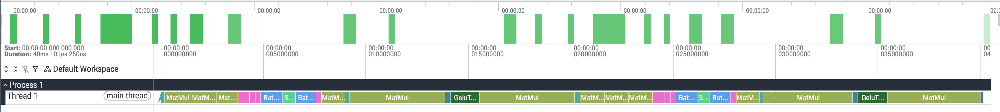
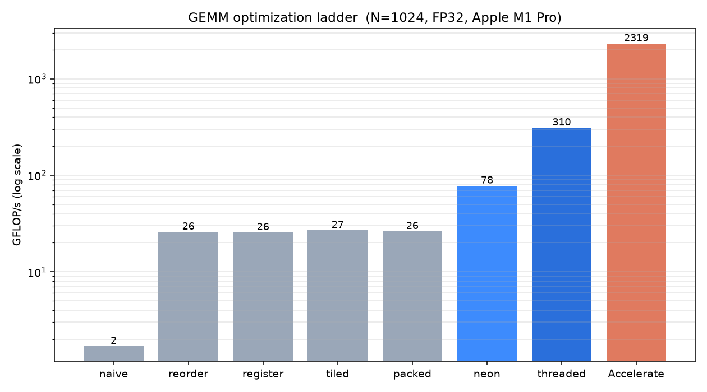
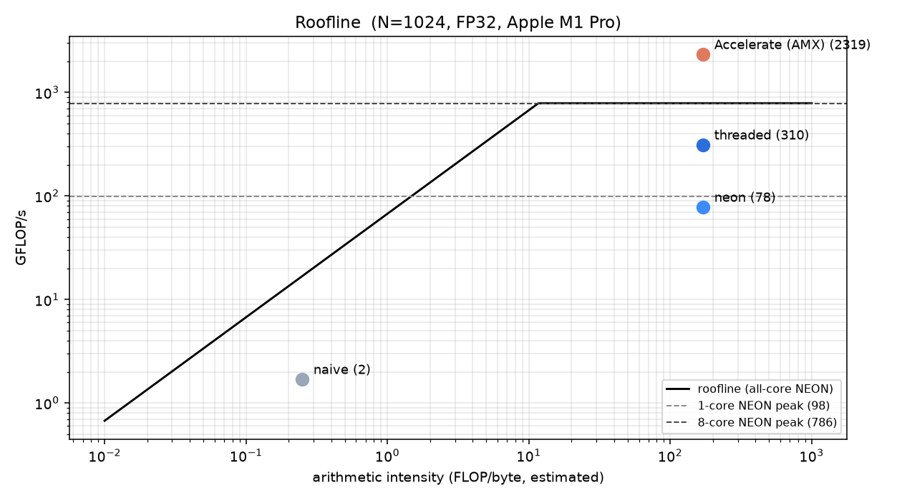

# MiniTensorRT

A lightweight C++ neural network inference runtime.

MiniTensorRT loads a model graph, executes it on CPU with a small hand-written operator set,
and applies ahead-of-time memory planning and graph fusion. It exists to answer a
specific question: what actually happens below PyTorch, and how much of the performance
gap between a naive executor and a production runtime can be closed by hand.

> Status: in development. See `docs/ROADMAP.md`.

## What it does

- Loads a static-shape model graph into a frontend-agnostic internal IR
- Executes a constrained FP32 operator set on CPU
- Runs real models end to end — an MLP and a **multi-head transformer block**
  (LayerNorm, multi-head self-attention, MLP), both validated against PyTorch to
  float32 rounding
- Plans tensor lifetimes and packs intermediates into a single reused arena
- Rewrites the graph with fusion and constant-folding passes, verified numerically equivalent
- Profiles per-operator cost and emits Chrome Trace Event output
- Benchmarks against PyTorch eager and ONNX Runtime CPU

## What it does not do

MiniTensorRT is not a TensorRT replacement and does not try to be. It is a narrow,
end-to-end runtime built to be understood completely rather than to be complete. Dynamic
shapes, training, and broad operator coverage are explicitly out of scope. See
`docs/DESIGN.md` for the reasoning behind each of these boundaries.

## Build

```bash
cmake -B build -DCMAKE_BUILD_TYPE=Release
cmake --build build -j
ctest --test-dir build --output-on-failure
```

## Results

Full benchmark matrix and per-optimization ablations: `docs/RESULTS.md`.

### Per-operator profile

The profiler emits Chrome Trace Event JSON, viewable in
[Perfetto](https://ui.perfetto.dev) or `chrome://tracing`. Regenerate with
`./build/benchmarks/bench_model --trace mlp.trace.json`.



The MLP executes as `MatMul → Add → Gelu → MatMul → Add → Softmax` on a single
thread. Fusing the first `MatMul → Add → Gelu` chain cuts planned peak
intermediate memory from 128 B to 80 B (see `docs/RESULTS.md`).

### GEMM optimization ladder

Matrix multiply dominates neural-net runtime, so it is where hand-optimization is
legitimate. Taking a naive triple loop to a blocked, packed, NEON-vectorized,
multithreaded kernel (FP32, N=1024, Apple M1 Pro):



**~1.7 → 310 GFLOP/s (≈180x)** across the ladder. The roofline shows where each
version sits against the machine's ceilings:



The single-core NEON kernel reaches **~79% of the 1-core NEON peak**. Apple
Accelerate is ~7x faster still — because it uses the **AMX matrix coprocessor**,
which sits *above the entire NEON roofline* and is not reachable from portable
NEON. Full per-step attribution and the honest gap analysis are in
[`docs/RESULTS.md`](docs/RESULTS.md).

<!-- Week 8: add the before/after fusion graph diagram here. -->

## Memory planning

Greedy-by-size arena allocation reuses space between tensors whose lifetimes do
not overlap. On the MLP: **224 B / 5 allocations (naive) → 128 B / 1 allocation
(planned)**, a 43% reduction. See `docs/RESULTS.md`.

## Design

Every significant decision is recorded with its alternatives and rationale in
`docs/DESIGN.md`.

## What I would build next in a production runtime

<!-- Week 8: this section is a large part of why this project is worth reading.
     Be specific and be honest about the gap. -->
