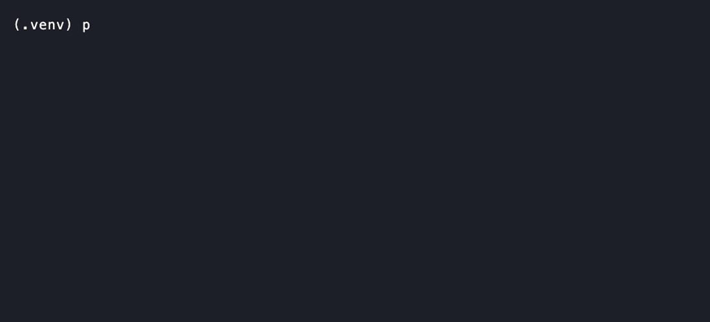

# MiniTensorRT

[](https://github.com/snehalgore1/mini-tensorrt/actions/workflows/ci.yml)

A lightweight C++ neural-network inference runtime, built from scratch to run **real GPT-2**.

It loads a model into a frontend-agnostic IR, executes a small hand-written FP32 operator
set on CPU, and applies the optimizations a production runtime does — ahead-of-time memory
planning, operator fusion, a tuned SIMD GEMM, and a KV-cache. It exists to answer one
question end to end: *what actually happens below PyTorch, and how much of the gap to a real
runtime can you close by hand?*

## It runs real GPT-2 and matches HuggingFace

The runtime loads real **GPT-2-small (124M)** weights exported from HuggingFace and generates
text — token-for-token identical to HuggingFace greedy decoding. Only tokenization is Python;
the entire forward pass and generation loop are this runtime.

```console
$ python python/gpt2_generate.py --prompt "The quick brown fox" --max-new 20 --check
=== MiniTensorRT GPT-2 ===
The quick brown foxes are a great way to get a little bit of a kick out of your dog.

=== HuggingFace greedy ===
The quick brown foxes are a great way to get a little bit of a kick out of your dog.

[CHECK] our gen ids == HF gen ids: True
```

<!-- Record the animated demo with `vhs docs/demo.tape` (produces docs/demo.gif). -->
<!--  -->

**Correctness is proven, not asserted:** a golden test checks our logits against HuggingFace
(0 / 64 next-token argmax mismatches, max abs error 4.3e-4), and generation is checked
token-for-token against `transformers`. See [`docs/RESULTS.md`](docs/RESULTS.md).

## Quick start

```bash
# build + run the unit/golden test suite (no Python needed)
cmake -B build -DCMAKE_BUILD_TYPE=Release
cmake --build build -j
ctest --test-dir build --output-on-failure

# run real GPT-2 (needs `pip install torch transformers`; ~500 MB weights, downloaded once)
python python/export_gpt2_hf.py --seq-len 64 --verify   # export + verify vs HuggingFace
python python/gpt2_generate.py --prompt "In a distant galaxy" --max-new 30
```

The large weights are regenerated by the export script, not committed; the C++ tests skip the
real-GPT-2 case when they are absent, so a clean checkout builds and tests with no Python.

## What it does

- Loads a static-shape graph into a frontend-agnostic internal IR
- Runs **real GPT-2-small (124M)** end to end — token/positional embeddings, 12 pre-LN
  transformer layers, causal multi-head attention, LM head — validated against HuggingFace
- Also runs an MLP and a multi-head transformer block, validated against PyTorch
- Plans tensor lifetimes and packs intermediates into a single reused arena
- Rewrites the graph with fusion and constant-folding passes, verified numerically equivalent
- A **KV-cache** decode path for fast autoregressive generation
- Profiles per-operator cost and emits Chrome Trace Event output

## Highlights (all measured — see [`docs/RESULTS.md`](docs/RESULTS.md))

### Tuned GEMM, wired into the model

Matrix multiply dominates transformer runtime, so it is where hand-optimization is
legitimate. Taking a naive triple loop to a blocked, packed, NEON-vectorized, multithreaded
kernel (FP32, N=1024, Apple M1 Pro):


**~1.7 → 310 GFLOP/s (≈180×)** across the ladder. The single-core NEON kernel reaches **~79%
of the 1-core NEON peak**; the roofline shows where each step sits against the machine's
ceilings:


Apple Accelerate is ~7× faster still — because it uses the **AMX matrix coprocessor**, which
sits *above the entire NEON roofline* and is not reachable from portable NEON. That kernel is
wired into the model's `MatMul`, giving a **~31× full-model speedup** over the naive path.

### Memory planning

Greedy-by-size arena allocation reuses space between tensors whose lifetimes do not overlap.
On the GPT-2 transformer block: **28.1 MB / 51 allocations (naive) → 3.4 MB / 1 allocation
(planned)** — an **88% reduction**, 24.8 MB reused.

### KV-cache

Incremental decode caches each layer's K/V instead of recomputing the whole graph per token:
**1.87× faster generation with byte-identical output**, verified against the full-recompute
path (`run_gpt2 --mode bench`).

### Per-operator profile

The profiler emits Chrome Trace Event JSON (viewable in
[Perfetto](https://ui.perfetto.dev) or `chrome://tracing`):


## What it does not do

MiniTensorRT is a narrow, end-to-end runtime built to be *understood completely* rather than
to be complete. Dynamic shapes, training, and broad operator coverage are out of scope. See
[`docs/DESIGN.md`](docs/DESIGN.md) for the reasoning behind each boundary, and
[`docs/ROADMAP.md`](docs/ROADMAP.md) for status.

## What I would build next in a production runtime

- **A GPU backend (CUDA).** The CPU path is the reference oracle; the next step is a tiled
  shared-memory GEMM and a device executor, validated against this CPU model, with an honest
  roofline vs cuBLAS.
- **Quantization (INT8 / FP16).** The FP32 path establishes correctness; INT8 with INT32
  accumulation (and an accuracy-vs-speed table on real GPT-2) is the production tradeoff that
  matters most, and FP16/tensor-cores is the real GPU inference path.
- **Fused attention.** Attention currently materializes the full score matrix; a
  FlashAttention-style tiled kernel with online softmax would remove that memory traffic.
- **A standard frontend (ONNX)** to prove the IR is truly frontend-agnostic and ingest models
  without a bespoke exporter.
